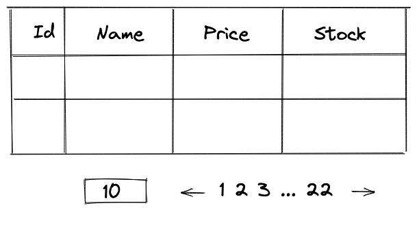
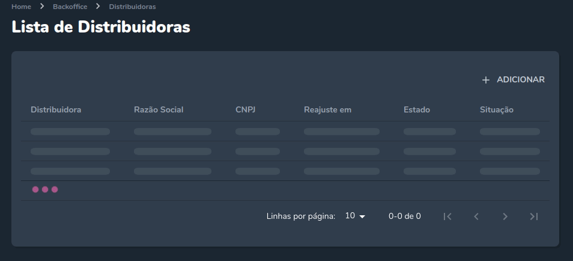

## Intro (Can skip)

Recently React team published React to version 18. Everything seems fine until everybody finds out about
a weird behaviour with `useEffect` hook. It will render twice if the following example code runs on strict mode.

```jsx
useEffect(() => {
  fetchSomething.then((data) => {
    setDataState(data);
  });
}, []);
```

[https://github.com/facebook/react/issues/24502](https://github.com/facebook/react/issues/24502).

To resolve this, Dan wrote an example to solve the problem and suggested we can use a library like **react-query**
to handle fetching data properly.

```jsx
useEffect(() => {
  let ignore = false;
  fetchStuff().then((res) => {
    if (!ignore) setResult(res);
  });
  return () => {
    ignore = true;
  };
}, []);
```

This caused the community to rage at first and everybody asked why do we even need a library like **react-query**
to do some simple fetch data.

However, this blog post won't explain why does the new hook behave like that. If you are interested in it,
you can view the Github issue and the link to the beta doc on it. I want to write a blog post explaining why we should
use a library like **react-query** to handle fetching data.

## The problem

Suppose the boss asks us to do a simple product listing screen like this.



The backend guy gives us an API to fetch these data. Ok, so what should we do to get the data and display products.
Maybe write the code like below.

```jsx
const [data, setData] = useState();

useEffect(() => {
  fetchProdutList({
    page,
    limit,
    perPage,
  }).then((res) => {
    setData(res.data);
  });
}, [page, limit, perPage]);

// return data to render
```

If the hook dependencies (page, limit, perPage) are changed from state or query string then it will fetch the new data.
We can even put the code to a hook so we can reuse it.

That all! Right guys, girls?

From my point of view, when I read that piece of code in a production code base,
I will think the person who wrote this code is using it the for a hobby or an MVP project, or is working in a company that doesn't have experience or doesn't have the superb requirement for the UX.

If all of these are not true then the person must have lacked experience in the Frontend field.
Sorry, don't hate me! 🤣. Maybe you have a secret reason then!.

When working with the UI, the hard part is not making them beautiful, but making them serve the users well and
provide meaningful and relevant experiences to users.

With the current code, when the user enters and uses the page, we don't provide the user information
about things happening around the user.

- Hey! I'm fetching the data, please wait!.
- Hey! You just press the next page button, all the paging buttons will be disabled in case you unintentionally
  press them when we fetch the data, and please wait!
- Oh snap! there is an error, I must display the error for the user to see.

Guess we can edit the code again to support these problems.

```jsx
const [data, setData] = useState();
const [isFetching, setIsFetching] = useState(false);
const [error, setError] = useState();

useEffect(() => {
  setIsFetching(true);
  setError();
  fetchProdutList({
    page,
    limit,
    perPage,
  })
    .then((res) => {
      setData(res.data);
      setIsFetching(false);
    })
    .catch((e) => {
      setError(e);
      setIsFetching(false);
    });
}, [page, limit, perPage]);

// return data, isFetching, error to render
```

Yay! Now we have `isFetching`, `error` states then we can disable paging buttons, and display the loading state like spinner,
skeleton table loading... We can display the error to the user too! We can celebrate now!

<figure>



  <figcaption>
    Example skeleton loading.
  </figcaption>
</figure>

HM... You might think or already know that it must have something more than that.

- Add a refresh button, so the user doesn't have to always press the F5 button to get the new products. We need a re-fetch function.
- If the error happen when fetch the data then the function should auto retry for a few times.
  If you use `axios` maybe you can install some retry middleware.
- Auto fetch new data every X seconds, so the user doesn't have to click on the refresh button.
  Guess we have to write `setInterval` code for this one.

Ok... they are all new features then guest we must write more code... So any more than that?.

HM, since we introduced loading state we see a lot of loading states, skeleton table loading, can we some how reduce it?.

Like when we go to page two and back to page one, the data from page one should be cached previously and reused.
In the background, we will re-fetch the data for page one. We could display a small loading in the table to indicate
that we are fetching in the background but we do not replace the table have previous data on it with loading spinner
or empty data, skeleton loading unless we haven't got the data before.

I see this feature is very commonly ignored and as a user, I have to see a big empty page with the loading spinner or
skeleton loading a lot when using an app. I always feel that the app is slow since they have so much loading even though
the data is not changing much and I'm sure that I have visited that page or was interacting with the previous data.

Display the cached data first unless there is a special case which is 95% not happen with a normal app and
fetch the new data in the background. I believe it's the right way.
This feature will require us to implement a caching system for fetching data.
Building a caching system is not that simple, but maybe we can do it with `React context` or libraries like `zustand`, `redux`, `recoil`...

After having a caching system, eventually, we can do more than that with an advanced thing is **optimistic updates**.

So what the heck is **optimistic updates**. I believe you have encountered it when you are using an app on any platform but you didn't realise.

For example a chat application. When you type a message and press send button, you can see the chat box immediately display your text.
But in the background, it still takes time to communicate with the server. When the server returns a status ok it will confirm the text is sent.
In case of an error, the chat app will mark the message as failed and will ask us to retry.

The same thing happens when you comment on a post on Twitter or Facebook you will see your comment is appended to the list immediately.
But trust me the comment is not committed to the database yet.

So with our table UI when will we use the technique **optimistic updates**?

We can do it when we update an entry like edit stock or add a new product but we are still on the listing product page.
Maybe edit the data inline table or in a modal. We could update the table data right away. At the same time sync with the API
and rollback if the update of the data is failed.

However, we need to communicate with the caching system to handle a few cases like:

- Prevent any interval re-fetching that might overwrite our optimistic data.
- After an optimistic update, we need to tell the caching system to re-fetch the affected data to make sure there won't be a mismatch of data
  between the client and the server.

As you can see from a simple UI it can become a complex UI with a lot of features. It's ok if your app doesn't need all of them.
But I believe you eventually will have to do it in the future. Because these features are quite common.

There still are a lot of cases missing out there, but the important thing is at least every feature I mention here
can be solved by **react-query** so you don't have to write a lot of code or implement the caching system by yourself.

Trust me, it's not an easy thing to do. I tried to solve these problems with **Redux** in the past.
**Redux** is not bad, however, it's just a generic global state so we still have to write a lot of code.

## Slightly introduction to react-query

The blog post isn't a tutorial for `react-query`. The blog post will highlight some of its key features that can help us build
better UX for our app and solve these problems I have mentioned in the previous section.

If you want to understand all of the `react-query` features, I suggest you read the official doc.
This will be a waste of time for me to write a complete tutorial, as the official document is so good.

```jsx
import { useQuery } from "react-query";

const { isLoading, isError, error, data, refetch } = useQuery(
  ["product-list", page, limit, perPage],
  async () => {
    const result = await fetchProdutList({
      page,
      limit,
      perPage,
    });
    return result.data;
  },
  {
    refetchInterval: 10000,
    retry: 3,
    enabled: true,
  }
);
```

This is the straightforward configuration for our API. Of course, you have to set up `QueryClientProvider`.

The lib comes with a built-in cache system. Our query data function
is a promise function that call `fetchProdutList` function and returns the data. We pass it the second parameter in the `useQuery` hook.

The hook will try to remember the data result of the query data function. But how does the lib know which result data does it belong to?
The answer is simple, the hook remembers the result data by sorting the data with a unique query key.

So what is our query key in the example? It's the array below.

```
["product-list", page, limit, perPage]
```

For example, when the user first enters our screen, the hook will get query key below.

```
["product-list", 1, 10, 10]
```

And try to obtain the data through the query data function. After the function return data it will be mapped to the query key.

So if we go to another screen and come back and the hook received the same query key, the hook will return the cached data immediately and will try to sync the new data in the background.
It will solve our problem display the cached data first instead loading or empty table data.

If the user changes the page to 2, a new query key will be called.

```
["product-list", 2, 10, 10]
```

Since the new query key doesn't have the data yet, the hook will return the `data` with `undefined`
value first while `isLoading` is equal to `true`. So we can display the spinner loading or skeleton table loading.
After the query data function returns the result `isLoading` is `false` and the `data` return with the received data.
Then we can turn off the loading and display the data on the table.

If the query data function throws an error, we can display the error with the `error` the property,
and we can set up a retry button with the `refetch` property.

The third parameter is the config for our query.

- `refetchInterval`: Re-fetch the query by every X ms times.
- `retry`: retry the query data function when it throws an error by X times.
- `enabled`: we can temporarily turn off query syncing with this option.
  For example, turn off the query syncing when we are editing the table data inline in case the row will be out of order.

What about **optimistic updates**?

```jsx
const queryClient = useQueryClient();

// Function to edit an inline table row data
async function handleOnEditInline(rowIndex, id, newData) {
  let prevData;
  const queryKey = ["product-list", page, limit, perPage];
  try {
    // Cancel the current query so it does not re-fetch when we try to optimistic update
    await queryClient.cancelQueries(queryKey);

    const listData = queryClient.getQueryData(queryKey);

    prevData = {
      ...listData[rowIndex],
    };

    listData[rowIndex] = {
      ...listData[rowIndex],
      ...newData,
    };

    // Optimistically update to the new data
    queryClient.setQueryData(queryKey, listData);

    // we sync the new data with the server
    await updateNewData(id, newData);
  } catch (e) {
    const listData = queryClient.getQueryData(queryKey);

    // If error we roll back the data
    listData[rowIndex] = prevData;

    queryClient.setQueryData(queryKey, listData);
  } finally {
    // Re fetch the data whenever error or success
    queryClient.invalidateQueries(queryKey);
  }
}
```

As you can see the `react-query` library can solve our problems flawlessly.
And I haven't used all the features that the library provided like pagination, infinite scroll, query invalidation, query cancellation...

If your application has a lot of create/update/delete actions, the library also has a helper hook called `useMutation`
which makes it easier for us to integrate these actions into the user interface.

```jsx
import { useMutation } from "react-query";

function Panel() {
  const { error, isLoading } = useMutation(
    (data) => {
      return axios.post("/product", data);
    },
    {
      onError: (error) => {
        toast({
          state: "error",
          message: error.message || error.toString(),
        });
        sendTracking({
          type: error,
          error,
        });
      },
    }
  );

  function handleAddSample() {
    mutate({
      name: "Sample",
      price: 10,
      stock: 10,
    });
  }

  return (
    <div>
      {error && <p>{error.message || error.toString()}</p>}
      <button disabled={isLoading} onClick={handleAddSample}>
        Add sample product
      </button>
    </div>
  );
}
```

The `react-query` library is very helpful when I develop a user interface.
I can spend more time solving business logic rather than spend a lot of time implementing a cache system, coding...
You should give it a shot. The sooner, the better!

Phew! It's a long post. If you can reach the line, then hopefully you have a great day and can learn something from my post.
